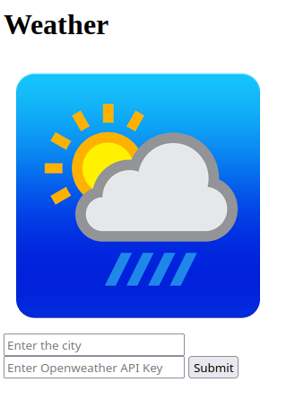

# WeatherApp

This is a weather display app for deployment on AWS cloud using terraform. 

*	Connects to Openweathermap API to fetch weather for a given geographic location
* Displays the weather (temperature and weather description) on a web page
*	Using terraform (Infrastructure as code) the app is deployed and weather data is displayed on AWS 
​
## Dependencies
+ Openweathermap API key. Get it here <https://openweathermap.org/>
+ html
+ css
+ Javascript
+ AWS account
+ Terraform

## Usage

Clone the repository:
	git clone https://github.com/RaghuKA/Weatherapp-AWS.git

Open the page OpenWeather/index.html on your web browser. In this page the city name and Openweathermap API key details have to be entered and click on "Submit" button.

  

Then the weather details will be displayed on the web browser.

## AWS deployment using terraform

Using the following commands the weather app can be deployed on AWS and accessed from the cloud. The terraform infrastructure as code is written in the file "Iac_aws_s3_Webapp.tf"

To check if the terraform code is valid
* terraform validate

To view the execution plan and resources to be created on AWS. This command is a dry run for the AWS deployment.
* terraform plan

To create the resources on AWS and deploy the web app on S3 static web hosting in AWS. After this command is entered, S3 bucket with the OpenwWeather folder will be created and the web app can be opened from cloud using the object url link of OpenWeather/index.html file.
* terraform apply

To delete the AWS resources created using terraform.
* terraform destroy
